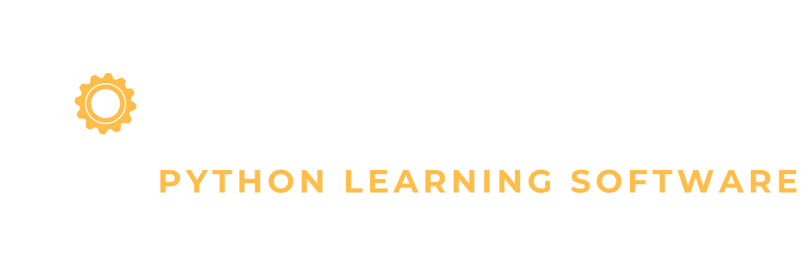

</img>
### WTF is this?
Code-Map_py aims to act as a tutoring tool for beginner to intermediate level programmers that are either just beginning or have experience with other languages and want to learn Python. 

This application provides up-to-date educational material and exercises taken from a variety of free, online, and university sources; and should be sufficient in teaching the fundamentals of programming with the Python(3.8) language. 

### Whats the Tech?
Code-Map_py is built with the Kivy v2.0.0 framework, with future integrations with a Python Lexer from Pygments to allow users to write syntax-highlighted code in the application itself.

---
Code-Map_py is **ONGOING** and has *yet to transition to an Alpha* 
release. Code-Map_py is and will remain completely open source.

*prototypes coming soon*